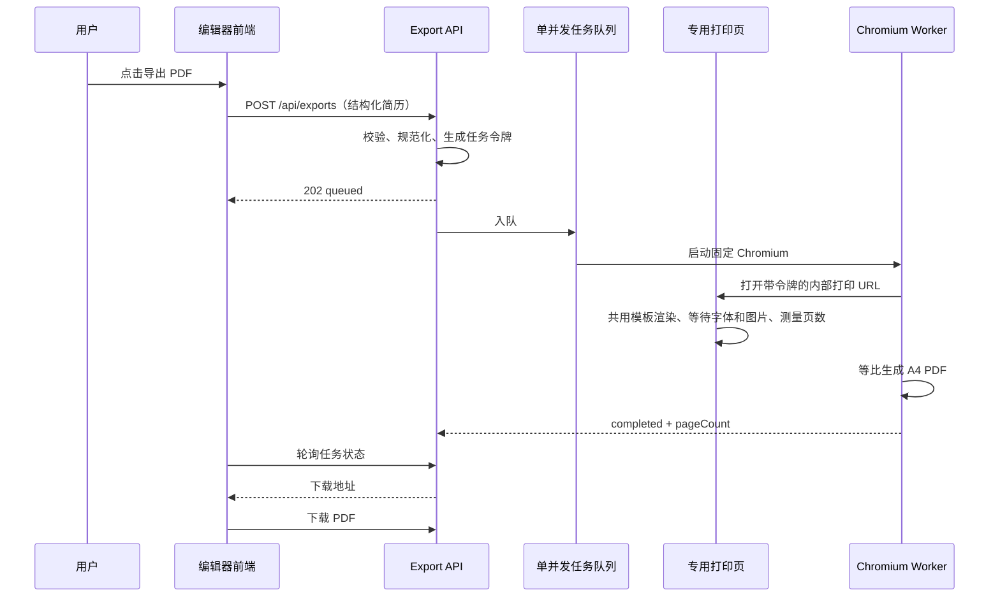

# 后端 PDF 导出架构

## 目标与版式契约

导出的第一原则是“相同结构化数据产生相同 DOM，相同 DOM 使用相同布局变量”。编辑预览与后端打印共同使用 `public/resume-renderer.mjs`，不再从编辑页面临时拼接 HTML，也不再在打印介质中把像素边距改写为毫米边距。

模板的逻辑画布固定为 820×1160 CSS px，字体、字号、行高、页面边距和模块间距全部来自同一份 `settings`。共用布局函数会在模块或经历条目无法完整放入当前页时增加页前留白，避免标题孤行和经历跨页；这份留白同时出现在预览和打印页中。Chromium 生成 PDF 时保持 820 px 排版宽度，再使用约 0.9677 的统一缩放映射到 A4。统一缩放不改变换行点，也不会触发二次分页。

## 任务状态与接口

任务状态为 `queued -> processing -> completed | failed`。当前实现采用进程内单并发队列，避免多份 Chromium 同时抢占 CPU 和内存；任务和文件默认保留 30 分钟，随后清理。

| 方法 | 路径 | 说明 |
|---|---|---|
| `POST` | `/api/exports` | 提交 `{ resume, fileName }`，返回 202 和任务令牌 |
| `GET` | `/api/exports/:id?token=` | 查询任务状态、页数和错误 |
| `GET` | `/api/exports/:id/file?token=` | 下载已完成的 PDF |
| `GET` | `/internal/print/:id?token=` | Chromium 专用打印页，不对业务 UI 暴露 |
| `GET` | `/health` | 服务健康状态 |

状态查询和下载必须同时具备任务 ID 与 256-bit 随机令牌。正式接入账号系统后，应在 API 网关或路由中增加用户会话校验，并给任务记录写入 `ownerId`；令牌仍可作为 worker 的内部能力凭证。

## 安全边界

- API 请求体默认不超过 2 MB，模块、经历条目、普通字段和富文本均有单独上限。
- 后端重建规范数据对象，未知字段不会进入打印任务。
- 富文本在共用渲染器中按标签和属性白名单清洗，脚本、样式、表单、SVG 和事件属性不会进入 DOM。
- 头像不是导出必填项。本地头像允许 PNG/JPEG/WebP Data URL，最大 1.5 MB；远程头像只允许 HTTPS 且域名必须配置在 `EXPORT_IMAGE_HOSTS`。头像为空、格式无效、过大或来源不受信任时，后端会忽略头像并继续导出，防止头像问题阻断简历生成或造成 SSRF。
- 内部打印页设置 CSP、`frame-ancestors 'none'`、`X-Frame-Options: DENY` 和 `nosniff`。
- PDF 文件保存在静态目录之外，只能通过鉴权下载接口读取。
- 文件名会移除路径字符和控制字符，响应同时提供 ASCII 回退名与 RFC 5987 UTF-8 文件名。

## 配置

| 环境变量 | 默认值 | 说明 |
|---|---|---|
| `HOST` | `127.0.0.1` | 监听地址；容器中使用 `0.0.0.0` |
| `PORT` | `4173` | HTTP 端口 |
| `EXPORT_DIR` | `./var/exports` | 临时 PDF 存储目录 |
| `MAX_EXPORT_REQUEST_BYTES` | `2097152` | 最大请求体字节数 |
| `EXPORT_IMAGE_HOSTS` | 空 | 逗号分隔的远程头像域名允许列表 |
| `EXPORT_CHROMIUM_PATH` | 自动探测 | 固定 Chromium/Edge 路径 |
| `EXPORT_CHROMIUM_NO_SANDBOX` | `false` | 仅在已隔离容器中设为 `true` |

## 生产演进

当前代码适用于单实例正式 MVP。需要横向扩容时保持 API 契约不变，将 `ExportService` 替换为持久化任务实现：

1. PostgreSQL 保存任务元数据、用户归属、模板版本和审计信息。
2. Redis/BullMQ 承担队列、超时、重试和并发控制。
3. 独立 worker 镜像固定 Playwright 与 Chromium 版本，不与 Web API 争抢资源。
4. PDF 写入 S3 兼容对象存储，下载接口签发短时 URL。
5. 打印任务只提交 `resumeId + revision + templateVersion`，worker 从可信数据源读取快照，避免客户端伪造历史版本。
6. 加入任务幂等键、指标（排队时长、渲染时长、失败率、页数）和结构化日志。

## 验收要求

- `npm test` 覆盖数据校验、任务鉴权、状态轮询和下载闭环。
- `npm run verify:export` 必须生成可读取的真实 PDF。
- `pdfinfo` 确认页面为 A4，页数与打印页测量一致。
- 将 PDF 渲染为 PNG，人工检查字体、换行、裁切、重叠、背景色和页尾。
- 使用文本提取工具确认中文可搜索，不是整页位图。
