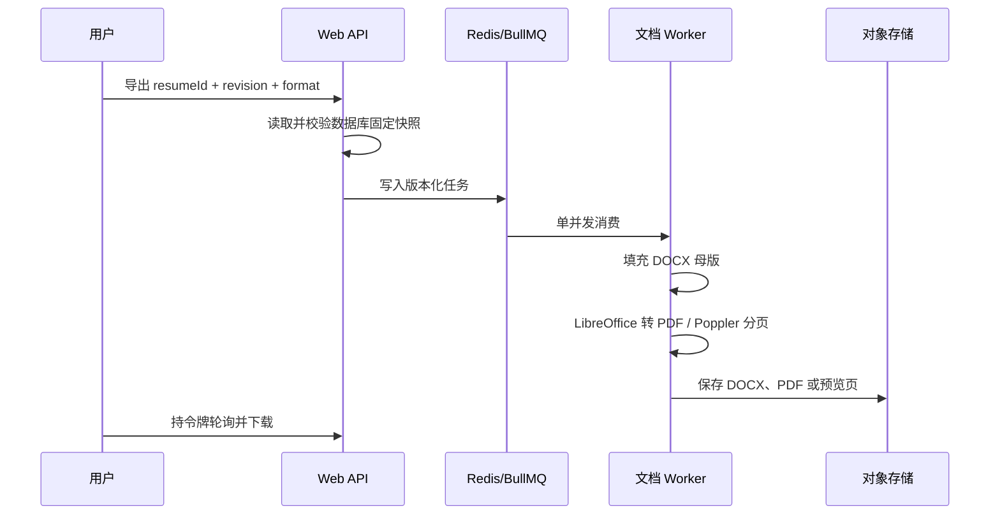

# 高保真文档导出架构

## 版式契约

Resume JSON v2 是唯一内容数据源，清理并标注后的 `native.docx` 是 DOCX 模板的唯一版式来源。编辑器保存固定修订后填充母版，并将同一份填充结果转换为分页 WebP 预览、可继续编辑的 Word 或 PDF；生产链路禁止携带原稿中的示例个人信息。

DOCX 模板不再使用浏览器 HTML/CSS 重绘作为正式预览或 PDF 来源。Word、PDF 与在线成品预览必须来自同一份填充后的 DOCX；HTML 渲染只保留给非 DOCX 内置模板的兼容路径。

## 服务与资源

- Web 镜像不安装文档工具，建议限制 `256–384 MB`。
- 文档 Worker 安装 LibreOffice、Poppler、Python/lxml 和固定字体，并发固定为 1，限制 `768 MB–1 GB`。
- Redis 保存任务状态、重试和去重信息，建议 `128–256 MB`；PostgreSQL 保存草稿及模板版本。
- 配置 `S3_BUCKET` 时结果写入 S3 兼容存储；否则使用 Web 与 Worker 共享的受保护卷。
- 每次 LibreOffice 转换使用独立临时 profile，60 秒超时并清理工作目录。

## API

- `POST /api/exports`：提交 `{ resumeId, revision, format, fileName }`。
- `GET /api/exports/:id?token=`：查询导出状态。
- `GET /api/exports/:id/file?token=`：下载鉴权文件。
- `POST /api/previews`：提交 `{ resumeId, revision }`，同版本去重并限制每份草稿 5 秒一次。
- `GET /api/previews/:id?token=`：查询预览状态和分页 URL。
- `GET /api/previews/:id/pages/:page?token=`：读取受保护分页图。

本地未配置 Redis 时保留进程内兼容队列和旧的结构化 HTML 导出链路；生产环境使用独立 Worker。

## 发布门禁

模板依次经过 `needs_mapping -> needs_qa -> ready`。发布脚本要求安全扫描通过、包含 `resume:profile.name` 等母版槽位，并且 manifest 中 `qa.approved=true`。视觉 QA 对原稿与固定样例逐页比较，要求 SSIM 不低于 0.98、显著像素差异不超过 2%，并完成人工裁切与重叠检查。
